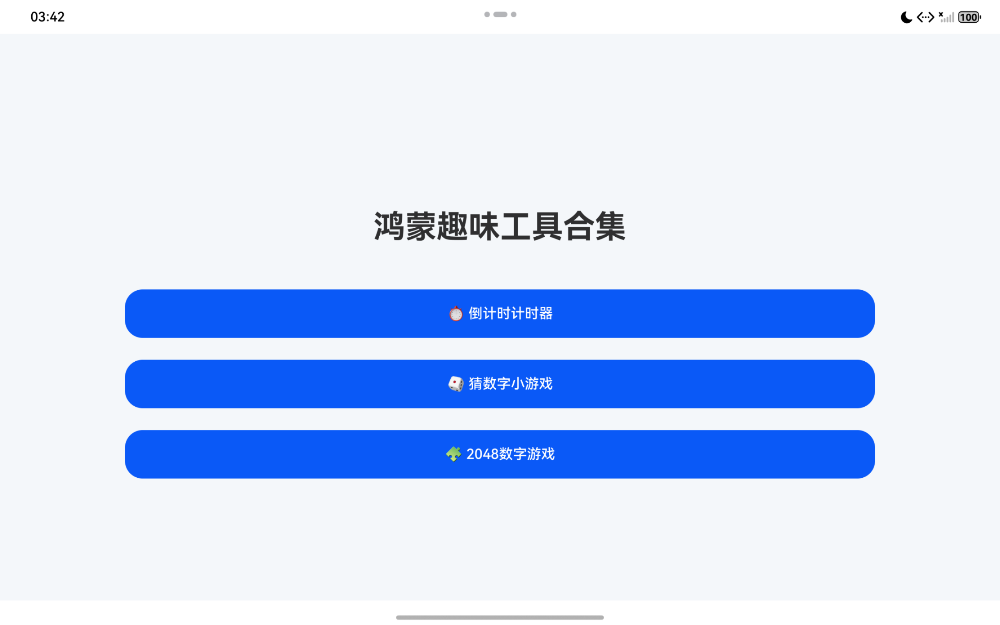
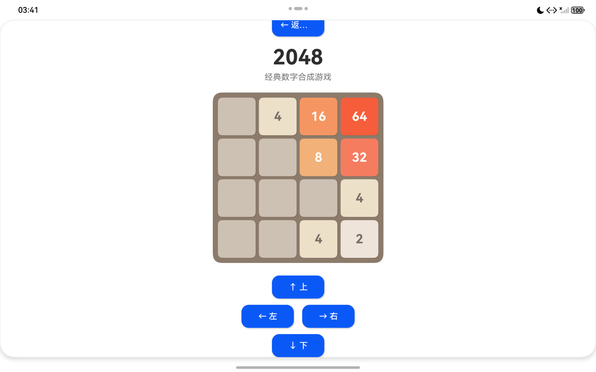
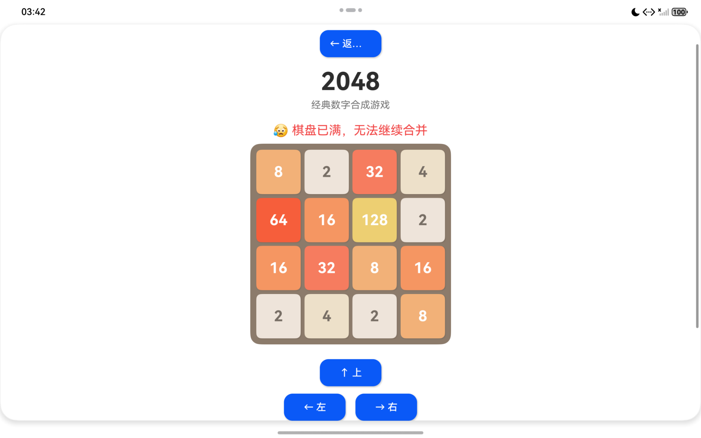
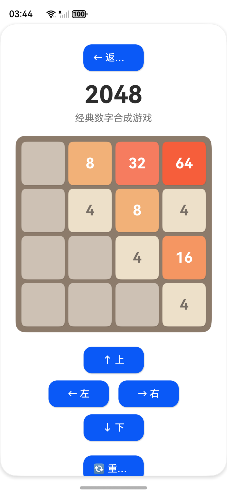
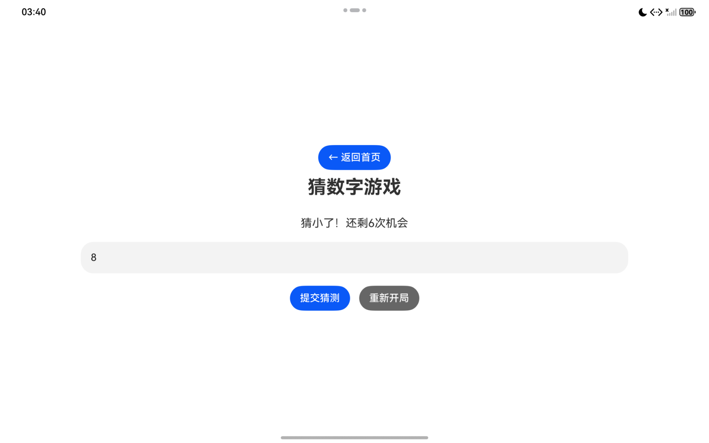
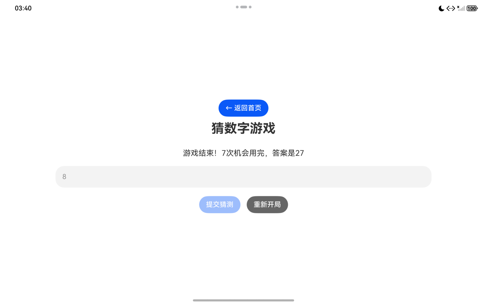
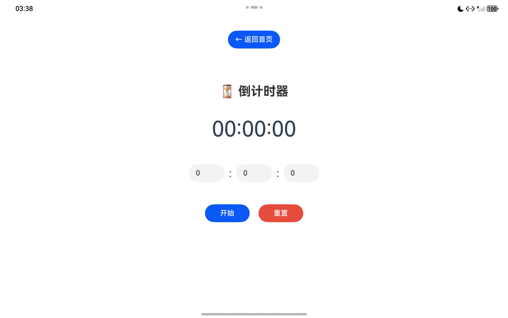
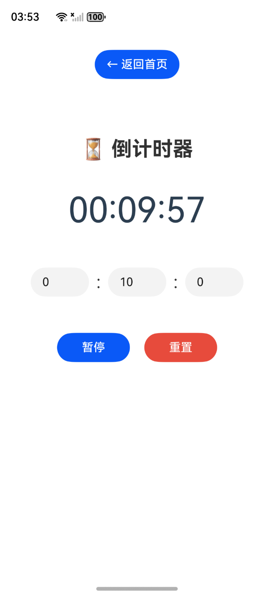

# HarmonyOS ArkTS 小游戏组件库
基于鸿蒙ArkTS开发的轻量小游戏合集，内置2048、猜数字、倒计时器三大模块，纯原生鸿蒙代码无第三方依赖，**支持一次开发多端部署+设备自由流转**，完美适配手机、平板、折叠屏设备。

## 🎮 功能预览
### 界面效果预览
#### 首页


#### 2048小游戏




#### 猜数字小游戏



#### 倒计时器


## 📦 包含模块
### 1. 2048 数字合成游戏
- 上下左右滑动/虚拟方向键移动方块
- 相同数字自动合并，合成2048判定胜利
- 游戏结束判定、一键重新开局
- 方块区分配色，深色模式自动适配
- 流转状态同步：跨设备接续当前游戏分数与棋盘

### 2. 猜数字小游戏
- 随机生成0~100目标数字
- 实时提示数字偏大/偏小/猜对
- 累计猜测次数统计，支持重置对局
- 轻量化输入交互面板
- 流转数据缓存：切换设备保留本局猜测记录

### 3. 自定义倒计时器
- 时分秒自定义时长输入
- 开始/暂停/重置完整控制逻辑
- 计时结束弹窗提醒
- 计时进度持久化，流转不中断计时
- 自适应布局，大屏/小屏自动调整控件尺寸

## ✨ 核心特色：一次开发多端部署 + 跨设备自由流转
### 1. 一次开发，多端部署
- 一套ArkTS代码，无需分别编写手机、平板页面
- 自适应栅格布局，自动适配不同屏幕尺寸、分辨率
- 区分大屏/小屏UI排版逻辑，平板展示多栏布局，手机紧凑布局
- 统一路由、统一业务逻辑，减少重复开发成本
- 支持打包后同时分发至手机、平板鸿蒙设备

### 2. 跨设备自由流转能力
- 基于鸿蒙分布式任务调度实现应用流转
- 游戏/计时状态分布式缓存，切换设备无缝接续进度
  - 2048：棋盘布局、当前分数、游戏胜负状态同步流转
  - 猜数字：目标数字、已猜记录、剩余次数跨设备保留
  - 倒计时：剩余时长、运行/暂停状态实时同步
- 无需手动存档，设备互联后一键流转当前页面
- 流转过程轻量无卡顿，低功耗分布式数据同步

## 🛠 环境依赖
- DevEco Studio 4.0+
- HarmonyOS SDK API 10 / API 11（支持分布式流转）
- ArkTS 标准语法，Stage模型开发
- 开启分布式数据管理、设备互联权限

## 🚀 快速使用
1. Clone本项目到本地
```bash
git clone https://github.com/xxx/harmony-mini-game-lib.git
